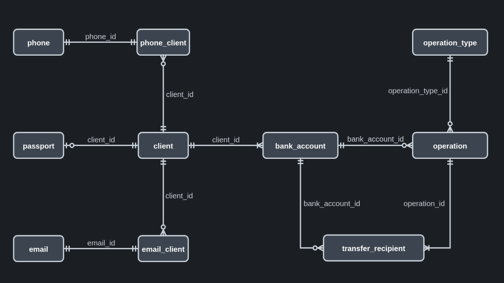

# Internet-bank
 

## Description
Internet-bank is a server-side REST-application that is implemented with using  
the Spring boot framework version 2.6.2. 
Its current capabilities allow a remote user to conduct the following  
operations with a bank account: creation, deletion, receipt balance, 
withdrawal of money, replenishment. 
To interact with a remote user, the application implements REST API. Data 
xchange takes place in .JSON format. 
All account information is stored in a database managed by the Postgresql DBMS. 
In case of conflict situations in the application, they are processed using 
the exception mechanism. The result of exception handling allows you to issue  
to the remote user exhaustive answers. 
All these situations, as well as successful completion of operations, are  
logged to files, located in the project folder  
internet-bank/src/main/resources/logs.   

## Structural elements

* REST API implemented in a class 
  ru.dreremin.internetbank.controllers.InternetBankController;
* The service layer is represented by the class 
  ru.dreremin.internetbank.services.BankAccountService;
* The model is represented by the BankAccount class. 
  Interaction with the database occurs through interface implementations 
  ru.dreaming.internetbank.repositories.BankAccountRepository, 
  inherited from CrudRepository<T, ID> and with the participation of the model; 
* To handle conflict situations, own exception classes (inheriting from 
  Exception) are implemented. They are in the package  
  ru.dreremin.internetbank.exceptions. To manage exceptions was provided the 
  class ru.dreremin.internetbank.controllers.ExceptionController;
* To receive and transmit data in .JSON format, was implemented classes located  
  in the package ru.dreremin.internetbank.dto.  

## Database
The database is currently represented by a single entity 'bank_account' with  
three attributes: 'id' (primary key), 'user_id', 'current_balance'. 

<table>
    <thread>
        <tr>
            <th colspan="4">Entity bank_account</th>
        </tr>
        <tr>
            <th>Attribute</th>
            <th>Data type</th>
            <th>Constraints</th>
            <th>Default</th>
        </tr>
    </thread>
    <tbody>
    <tr>
        <td>id (primary key)</td>
        <td>bigserial</td>
        <td></td>
        <td></td>
    </tr>
    <tr>
        <td>user_id</td>
        <td>bigint</td>
        <td>not null, user_id > 0, unique</td>
        <td></td>
    </tr>
    <tr>
        <td>current_balance</td>
        <td>numeric(20.2)</td>
        <td>not null, current_balance > 0</td>
        <td>0.00</td>
    </tr>
    </tbody>
</table>

### Logical data model

